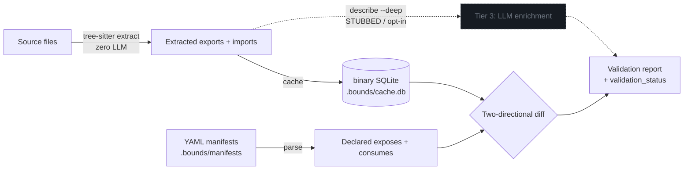

<div align="center">

# Bounds

### Architecture contracts your AI agents can trust


**Bounds** is a CLI that turns your codebase's architecture into deterministic, machine-readable
manifests — validated against source with **tree-sitter (zero LLM)**. An AI coding agent reads a
~300-token subsystem contract instead of a dozen source files (thousands of tokens), and gets
structural validation it can trust, in milliseconds.

An agent's only real cost is **tokens into context**. Bounds is built around one thesis: agents
should spend tokens *deliberately* (one cheap CLI call returns a verified contract) and never
*accidentally* (the `.bounds/` directory is hidden, and its cache is a binary SQLite file an agent
can't blindly slurp into context).

[](https://github.com/Farzin312/bounds/actions/workflows/ci.yml)
[](LICENSE)
[](https://www.python.org)
[](#cross-platform-support)
[](#how-it-works)

[Quick start](#quick-start) · [Use cases](#use-cases) · [Token cost](#token-cost-comparison) · [How retrieval scales](#how-retrieval-scales-and-why-it-matters-more-as-you-grow) · [For AI agents](#for-ai-coding-agents) · [How it works](#how-it-works) · [Security](#security) · [Architecture](ARCHITECTURE.md) · [Roadmap](#roadmap)

</div>

---

## The problem

When an AI agent opens your repo, it does the expensive thing: it reads source files — sometimes
dozens — to reconstruct what each part does and how the parts connect. Every file burns tokens.
Every wrong guess produces a bad edit. And the agent's mental model has no way to *check* itself —
nothing tells it when its picture of the architecture has drifted from the code.

But an agent doesn't need every function in `auth.ts`. It needs:

> *"auth exposes `login`, `verify`, `register` and talks to the database via `user_repository`."*

That fits in five lines of YAML — and a machine can reason about it **deterministically**.

<div align="center">

</div>

*~300 tokens to understand a subsystem, verified by tree-sitter — not thousands from source.*

## What Bounds does

Bounds maintains a hidden `.bounds/` directory of **subsystem boundary manifests**: tiny YAML files
that declare each subsystem's role, its public interfaces (exposes), and its cross-boundary
dependencies (consumes). It then uses **tree-sitter** (never an LLM) to extract the *actual* exported
symbols and imports from your source and **validates the manifests against reality** — in both
directions.

The result is a structural contract an agent can query, and a CI pipeline can enforce:

- **`bounds describe`** — hand an agent a subsystem's exact public surface as JSON, instead of raw files. Every interface is flagged `verified: true/false` (tree-sitter confirmed) so the agent can trust the manifest without opening source.
- **`bounds validate`** — catch drift the moment exports stop matching the manifest. 6 checks, zero LLM.
- **`bounds validate --quick`** — git-diff incremental validation, safe for every commit.
- **`bounds preflight`** — 6 pre-PR checks: drift, boundaries, contracts, cycles, orphans, cross-subsystem impact.
- **`bounds impact <name>`** — transitive blast radius: who breaks if this subsystem's surface changes.
- **`bounds discover` / `bounds calibrate`** — onboard an un-bounded repo in one command, then keep manifests honest against tree-sitter reality.
- **`bounds agent --sync`** — wire Bounds into eight coding agents (Claude Code, Codex, Cursor, …) with one command.
- **Deterministic** — same input, same byte-stable output. No network, no flakiness, no accidental token spend.

---

## Use cases

### ▸ "Will this change break anything?" — let the agent check, before the PR

The hardest question in a large codebase is *what does this change touch*. Bounds answers it
structurally, in a few hundred tokens, so an agent (or you) can reason about blast radius **before**
writing the change and **prove** nothing broke after:

```bash
bounds impact auth          # who depends on auth? → billing, api, frontend (+ the exact interfaces)
bounds describe billing     # what does billing rely on from auth? (verified contract, ~300 tokens)
# … the agent makes the change, now knowing the reach …
bounds preflight            # contracts + boundaries + cycles + drift — fails if a consumer was broken
```

`bounds impact` returns the transitive consumer set and the interfaces each consumer relies on.
`bounds preflight` then catches the failure modes that actually matter — a removed export a consumer
still imports, a new cross-boundary dependency, an introduced cycle — each with a deterministic fix
suggestion. The agent never had to read `billing/`, `api/`, and `frontend/` to find out it was about
to break them.

### ▸ Drop an agent into a strange repo and have it productive in seconds

```bash
bounds list                 # the whole architecture map (roles + dependency counts) — one cheap call
bounds describe payments    # one subsystem's verified public surface, instead of opening its files
```

No directory spelunking, no grepping for `class`/`export`. `bounds agent --sync` wires this in as the
default workflow for whatever agent the contributor uses.

### ▸ Enforce architecture in CI, not in a wiki

```bash
bounds ci --install         # generate a GitHub Action / pre-commit hook / GitLab job
```

Boundary violations and drift become a failing check with a fix suggestion — a toggle, not a
convention nobody follows.

---

## Why not another code graph?

Bounds exists in a crowded space of code intelligence tools (CodeGraph, tree-sitter-analyzer,
roam-code, CodeSage). Every prior approach shares the same assumption: **parse everything, build a
graph, let the AI figure it out.** This creates three problems Bounds solves:

### 1. Token bloat

A full code graph of a Django codebase can be tens of thousands of tokens. An agent pays this cost
just to find where `login()` is defined. Bounds gives you the answer in a few hundred tokens of
JSON — one CLI call.

### 2. No intent signal

A graph tells you what IS, not what SHOULD BE. Every symbol is equal. Bounds distinguishes public
contracts from private implementation by design — the developer declares the boundary, and Bounds
enforces it.

### 3. No drift detection

A graph is always correct by definition (it reflects reality). It cannot tell you that someone
added an export without declaring it, or removed an interface another subsystem depends on.
Bounds's validation is the difference between *declared intent* and *extracted reality*.

### In short

Code graphs are too large and noisy for an agent to consume cheaply, they capture what *is* without
any signal of human-declared intent or boundaries, and they drift from the code the moment something
changes with no way to flag it. Bounds targets exactly those three gaps: a tiny per-subsystem
contract instead of a full symbol graph, an explicit declared boundary instead of an undifferentiated
graph, and two-directional validation that catches drift between declared intent and extracted
reality. The two are complementary, not competitive — use a code graph to *explore* ("what's in this
codebase?") and Bounds to *validate* ("what should this architecture look like?"). An agent that
reads the Bounds map first then digs into specific symbols uses any graph tool more efficiently.

<sub>A full side-by-side comparison table is in the [appendix](#appendix-bounds-vs-code-graphs) at the
end of this README.</sub>

### What Bounds does NOT do

Bounds is deliberately narrow. Being explicit about the edges is part of why you can trust the parts
that do work:

| Bounds does **not** | What that means |
|---------------------|-----------------|
| Execute your code | Pure static tree-sitter parsing — no runtime, no semantics inferred from behavior. |
| Understand intent on its own | It validates **human-declared** manifests; it does not invent what a subsystem *should* be. |
| Produce semantic summaries without `--deep` | The Tier-3 LLM tier is **stubbed** in the MVP; the structural path is intentionally LLM-free. |
| Replace exploratory code graphs | It **complements** them — graph to explore, Bounds to validate a declared boundary. |
| Guarantee an agent reasons well or finishes the task | It cuts token load and validates structure; it makes no claim about task success. |
| Auto-update your manifests | Drift is detected and proposed; you apply fixes with `calibrate --apply`. |
| Validate every language | Python + TS/JS are tree-sitter-verified today; other languages fall back to YAML-only (declared files) and are otherwise skipped. |

---

## Quick start

### Install

**Works today — install from a git ref** (the PyPI release workflow is configured but the package
is not published yet, so install directly from the repo):

```bash
# Recommended: isolated CLI install from the repo (pipx sidesteps PEP 668)
pipx install "git+https://github.com/Farzin312/bounds.git"

# Or into the current environment
pip install "git+https://github.com/Farzin312/bounds.git"
```

<details>
<summary><b>From a local clone (development)</b></summary>

```bash
git clone https://github.com/Farzin312/bounds.git
cd bounds
pip install -e ".[dev]"     # editable install + pytest
```
</details>

<details>
<summary><b>Bootstrap installer (<code>install.sh</code>)</b></summary>

`install.sh` is the PEP-668-safe bootstrap (pipx-preferred). It targets the PyPI package by default —
so it fully works **once `bounds` is published to PyPI** — but you can point it at a git ref today:

```bash
BOUNDS_REF=main ./install.sh   # installs git+https://github.com/Farzin312/bounds@main
```

The installer never does `curl | sh` remote execution, `eval`, or `sudo` — it only runs `pipx`/`pip`
against the package name.
</details>

<details>
<summary><b>Homebrew & curl (bootstrapped — pending PyPI publish)</b></summary>

A Homebrew tap formula (`Formula/bounds.rb`) and a `curl | bash` flow are wired up, but both resolve
the package from PyPI and so depend on the PyPI publish landing first. The formula currently ships
placeholder `url`/`sha256` for exactly that reason.

```bash
brew install Farzin312/bounds/bounds   # works once the tap + PyPI release are published
```

**Standalone signed binaries** (no Python required) are planned for **v0.2.0**.
</details>

```bash
bounds --help    # verify the install
```

### Onboard a project (one command)

```bash
cd your-project
bounds discover                     # preview auto-generated manifests   (dry-run)
bounds discover --apply             # write root.yaml + manifests
bounds agent --sync                 # wire Bounds into your coding agents
```

`bounds discover` groups source files by directory, scores candidates, tree-sitter-extracts each
subsystem's verified `exposes`, infers `consumes` from the cross-candidate import graph, and seeds a
`role`/`criticality` from graph degree. It never overwrites existing manifests.

<details>
<summary><b>Or scaffold manually</b></summary>

```bash
bounds init --root                  # scaffold .bounds/root.yaml
bounds init --subsystem auth        # add .bounds/manifests/auth.yaml
# edit the manifest to declare paths, exposes, consumes...
```
</details>

### Explore, validate, keep honest

```bash
bounds list                         # whole-system map: every subsystem  (JSON)
bounds describe auth                # one subsystem's verified surface    (JSON)
bounds impact auth                  # who breaks if auth's surface changes
bounds validate --quick             # fast incremental check              (JSON)
bounds validate --human             # same data, human-readable
bounds preflight                    # 6 pre-PR checks, blocking
bounds overview                     # project health dashboard
bounds calibrate                    # reconcile manifests vs source (diff; --apply to write)
```

> `.bounds/` is hidden and **only** touched by the `bounds` CLI — nothing auto-loads it. Its
> extraction cache is a **binary SQLite file** (`.bounds/cache.db`), so a tool that blindly `cat`s
> every file in a directory gets binary bytes rather than a parseable token blob. This is an
> *accidental-context-burn* defense, **not** access control: the manifests in
> `.bounds/manifests/*.yaml` are plain human-readable YAML and any agent can still read them
> directly. The binary cache only keeps the *derived* extraction data from being trivially slurped
> in by naive file-dumping tools.

---

## Token Cost Comparison

An agent's cost is **tokens into context**, so that is the only unit that matters here. The core
claim: Bounds reduces the context an agent needs to understand your codebase from thousands of
tokens to a few hundred.

### Measured on this repo

> Token figures are estimates from the byte size at ~4 chars/token (a standard rough rule for
> JSON/source). They are estimates, not exact tokenizer counts — and they come from **one codebase
> (this repo): a single data point, not a cross-repo corpus study.** The numbers are real
> (reproducible via `benchmarks/run.py`); treat the ratio as illustrative, not a guaranteed average.

To understand the `models` subsystem's public API (9 exports, consumed by 5 subsystems):

| Read this | Size | Token estimate |
|-----------|------|----------------|
| `bounds describe models` (verified JSON contract) | 1,593 bytes | **~400 tokens** |
| `src/bounds/models.py` (the full source file) | 11,489 bytes | **~2,900 tokens** |

The agent gets the verified public surface for **~400 tokens** instead of **~2,900 tokens** of
source — and in real cases a subsystem spans several files, so the source side is usually far larger.

For the whole-system map across all 8 subsystems:

| Read this | Size | Token estimate |
|-----------|------|----------------|
| `bounds list` (every subsystem: role, criticality, graph, interface counts) | 2,633 bytes | **~660 tokens** |

`bounds list` is the cheap whole-system map: **~660 tokens** for the complete architecture instead
of grepping a dozen-plus source files and mentally reconstructing it.

| Scenario | Without Bounds | With Bounds | Token savings |
|----------|----------------|-------------|---------------|
| Understand one subsystem | Read 1–15 source files (thousands of tokens) | `bounds describe <name>` (~250–400 tokens of verified contract) | ~85–99% |
| Map all subsystems | Grep `class\|def\|export` across the tree | `bounds list` (~660 tokens) | Near-total |
| Dependency blast radius | Trace imports by hand | `bounds impact <name>` (transitive consumers + relied-on interfaces) | ~99% |
| Detect architecture drift | Manual code review | `bounds validate` (structured report, 0 LLM) | Subjective → deterministic |
| CI gate for boundary violations | No automated option | `bounds preflight --ci` | Previously impossible |

---

## How retrieval scales (and why it matters more as you grow)

The token win isn't a flat discount — it *widens* with codebase size, and that is the whole point.

- **Reading source is O(files).** To understand a subsystem by reading it, an agent's token cost grows
  with how much code that subsystem (and its neighbors) contains. Bigger codebase → bigger reads.
- **A Bounds contract is O(public API).** `bounds describe` returns only the declared, tree-sitter-verified
  surface — exposes, consumes, `consumed_by`. A subsystem with 50 internal functions and 5 exports is
  still ~5 lines. As the implementation grows, the contract stays roughly **flat**.

| Codebase size | Read the subsystem's source | `bounds describe <name>` |
|---------------|-----------------------------|--------------------------|
| Small (a few files) | hundreds–low-thousands of tokens | ~300 tokens |
| Medium (dozens of files) | many thousands of tokens | ~300 tokens |
| Large (hundreds of files) | tens of thousands of tokens | ~300 tokens |

<div align="center">

</div>

This compounds with a property of LLMs that punishes the naive approach: **models get *worse* as their
context fills** — the "lost-in-the-middle" / context-rot effect, where relevant facts buried in a large
prompt are recalled less reliably. So in a large codebase the source-reading approach is doubly bad: it
costs more tokens *and* degrades reasoning quality. Targeted, minimal retrieval — one verified contract,
the dependency map, a blast-radius query — is the behavior that actually scales. Bounds is built to make
that the cheap default: the architecture lives outside the model's context until a single CLI call pulls
in exactly the slice it needs.

> Measured token economics, the scaling methodology, and per-model community results live in
> [benchmarks/](benchmarks/README.md). Token counts are tokenizer-dependent — results note the model/tokenizer used.

**Staleness is caught, not assumed.** A cheap contract is only useful if you know it still matches
the code. Bounds keeps the contract honest in four places: `bounds validate --quick` runs per-commit
(git-diff incremental), `bounds calibrate` reconciles manifests against tree-sitter reality, the CI
gate (`bounds preflight --ci`) blocks drifting PRs, and every `describe`/`validate` payload carries a
machine-readable `validation_status` an agent can branch on. *You declare the boundary in YAML;
Bounds validates it against reality, both directions, on every commit.*

---

## Performance

Real wall-clock times (including Python interpreter startup) on M3 Pro, all measurements median of
3 runs:

| Command | Measured | Target | Status |
|---------|----------|--------|--------|
| `bounds validate --quick` | ~353ms | <200ms | Near target (startup overhead included) |
| `bounds validate` (full) | ~207ms | <500ms | Pass |
| `bounds list` | ~250ms | <20ms | Headroom for optimization |
| `bounds describe <name>` | ~307ms | <50ms | Headroom for optimization |

> Measurements include Python interpreter startup (~150ms). The actual validation logic completes
> in ~130-200ms. Run on a warm cache, `--quick` mode re-extracts zero files when nothing has
> changed — pure reference propagation and exit.

---

## How it works

### Three-tier data model

Only the top tier ever costs a token:

| Tier | Source | Cost | What it contains |
|------|--------|------|------------------|
| **Deterministic** | tree-sitter extraction | **Zero LLM** | Exported symbol names, file paths, import statements |
| **Declared** | Human-written YAML | **Zero LLM** | Descriptions, boundary definitions, contract metadata |
| **Semantic** | LLM, on demand (`--deep`) | Tokens per use | Type signatures, intent summaries |

The core validation loop runs Tiers 1 + 2 only — never touches an LLM. `bounds describe` **merges
Tiers 1 + 2**: every `exposes` entry carries its `file`, an `entry_point: true` flag when it sits in
a root `entry_points` glob, and a `verified: true/false` flag (true = tree-sitter confirmed it
exists). That merge is what lets an agent trust the manifest without reading source. Tier 3 is opt-in
enrichment (`describe --deep`); the LLM call is **stubbed in the MVP** — no structural path ever
touches an LLM.

### The cache is binary by design

Extraction results are cached in `.bounds/cache.db`, a **binary SQLite file** (SQLite ships with
Python — no new dependency). This is a deliberate *accidental-context-burn* defense, not access
control: a tool that blindly dumps a directory's files gets binary bytes rather than a giant
parseable token blob. It does **not** stop a determined agent — the manifests themselves are plain
YAML — it only keeps the derived extraction data from being slurped in by naive file-dumping tools. The cache is subsystem-indexed
(partial per-subsystem reads), gitignored, and managed by `bounds cache` — `--inspect` prints a
token-lean counts-only summary (never symbol dumps), `--prune` drops dead rows, and `--migrate`
converts a legacy `state.json` cache (auto-migrated on first load anyway).

### Validation engine

```
Source files ──tree-sitter──> Extracted exports  ──┐
                                                   ├──> Two-directional diff ──> Validation report
YAML manifests ──parse──────> Declared exports  ───┘
                                    +
                              Consumed interfaces
```

The same flow, including the opt-in semantic tier:



> The structural path (solid arrows) never touches an LLM. Tier 3 (dotted) — `describe --deep` — is
> opt-in enrichment and **stubbed in the MVP**; it is not part of validation. Zero LLM in the
> structural path: deterministic, sub-200ms, no network, no API keys.

The engine checks both directions:
- **Stale manifest**: the manifest claims an export the source doesn't provide.
- **Incomplete manifest**: source exports something the manifest doesn't declare.
- **Cross-subsystem drift**: consumer declares an interface the provider no longer exports.

### Quick mode (incremental)

1. `git diff HEAD~1 --name-only` — find changed files.
2. Re-extract tree-sitter only for changed files.
3. Compare extracted exports against declared per subsystem.
4. **Reference propagation**: for each changed subsystem, check every consumer's declared interfaces
   against current exports — interface-name comparison, zero tree-sitter.

---

## Language support

| Language | Extraction | Describe Merge | Validate | Status |
|----------|-----------|---------------|----------|--------|
| **Python** | Full (functions, classes, decorators) | Yes | Yes | **Implemented** |
| **TypeScript / JavaScript** | Full (exports, classes, interfaces) | Yes | Yes | **Implemented** |
| **Go** | Functions, methods, exported symbols | Planned | Planned | Future (v0.2.0 target) |
| **Rust** | `pub fn`, `pub struct`, `pub enum`, traits | Planned | Planned | Future (v0.2.0 target) |
| **Java** | Classes, interfaces, public methods | Planned | Planned | Future (v0.3.0 target) |
| **Fallback** | YAML-only metadata, no tree-sitter | No merge | Data integrity only | Only for files **explicitly declared** in a manifest |

Adding a language is one class (`extract.base.LanguageAdapter`) plus a registry entry. The fallback
only covers files a manifest **names directly** (metadata is preserved, but there is no tree-sitter
verification); files in an unsupported language that are only **auto-discovered** are silently
skipped rather than validated.

---

## For AI coding agents

Bounds is a plain CLI that emits JSON, so **any agent that can run a shell command can use it
today**. The universal instruction is the same:

> Prefer `bounds describe <name>` / `bounds list` over reading raw source to understand
> architecture. Output is JSON by default — parse it. Run `bounds validate --quick` after edits
> and treat a non-`fresh` `validation_status` as a signal to update the manifests.

Compliance is **advisory, not enforced.** Bounds writes these instructions into the configs agents
already read, but it cannot prevent an agent from ignoring them or reading raw files directly — it
works *with* cooperating agents, lowering the cost of the right behavior rather than blocking the
wrong one. (The CI gate is the one hard enforcement point, and it runs in your pipeline, not in the
agent.)

> **Claude Code plugin auto-detection.** Claude Code (and compatible agents) can auto-detect a
> project's `.bounds/` directory and use the `bounds` CLI to load subsystem manifests on demand —
> no manual wiring needed. When the directory is present, the agent reads boundary contracts
> instead of raw source automatically.

### One-command agent setup: `bounds agent --sync`

No more manual copy-paste. `bounds agent --sync` writes the canonical contract into `AGENTS.md`
(the cross-ecosystem standard agents already read) plus a short pointer file for **eight** coding
agents — telling each one to query `bounds describe` /
`bounds list` instead of reading raw source, and to run `bounds validate --quick` after edits:

| Agent | Config file written |
|-------|---------------------|
| **Claude Code** | `.claude/commands/bounds.md` |
| **Codex CLI** + **OpenCode** | shared `AGENTS.md` |
| **Gemini** | `GEMINI.md` |
| **GitHub Copilot** | `.github/copilot-instructions.md` |
| **Cursor** | `.cursor/rules/bounds.mdc` |
| **Aider** | `.aider.conf.yml` |
| **Windsurf** | `.windsurf/rules/bounds.md` |

Shared files (`AGENTS.md`, `GEMINI.md`) get a marked Bounds block that leaves your other content
intact; hand-written configs are never clobbered. Companion flags:

```bash
bounds agent --detect          # list which agents are present in this project
bounds agent --check           # verify each detected agent has a Bounds config
bounds agent --sync --claude   # scope --sync/--check to one agent (--codex, --cursor, …)
```

`bounds agent --sync` is the single supported path — the canonical contract lives in
[`AGENTS.md`](AGENTS.md) (committed; the standard filename agents already read) and every per-tool
pointer is generated from it, so there's no template to copy or keep in sync. A native MCP server
(`bounds mcp`) is on the [roadmap](#roadmap) for v0.3.

---

## Security

Bounds is designed with 7 security principles that are enforced from day one:

| # | Principle | Detail |
|---|-----------|--------|
| 1 | **No code execution at install** | Pure Python wheels only — no setup.py scripts, no post-install hooks |
| 2 | **No network at runtime** | Zero telemetry, analytics, API calls, or phone-home. No opt-out toggle needed |
| 3 | **No credential handling** | Never asks for, stores, or transmits API keys, tokens, or secrets |
| 4 | **No eval/exec** | tree-sitter for parsing (safe C bindings), PyYAML for manifests |
| 5 | **Hidden directory safety** | Writes only within `.bounds/` — never outside the project root |
| 6 | **Dependency minimums** | Minimum versions specified, not pinned — users get latest compatible deps |
| 7 | **Signed releases (future)** | sigstore/cosign attestations planned for v0.2.0 |

For the full disclosure policy and distribution integrity details, see [SECURITY.md](SECURITY.md).

---

## Command reference

| Command | What it returns |
|---------|-----------------|
| `bounds init` | Scaffolds `.bounds/`. `--root`, `--subsystem <name>`, `--namespace <ns>`, `--root <path>` |
| `bounds list` | All subsystems with role, criticality, exposes, consumes, consumed_by. `--namespace <ns>` filters |
| `bounds describe <name>` | One subsystem's merged Tier-1+2 surface as JSON (`verified`/`file`/`entry_point` per expose). `--namespace <ns>` describes a whole group; `--deep` adds the (stubbed) Tier-3 LLM tier |
| `bounds impact <name>` | Transitive consumer blast radius + which interfaces each direct consumer relies on. Zero LLM |
| `bounds validate` | Full validation — all 6 checks. `--quick`, `--mode quick\|full\|preflight\|hotfix\|audit`, `--enforce on\|off`, `--base <ref>` |
| `bounds preflight` | 6 pre-PR checks in blocking mode |
| `bounds overview` | Project dashboard: subsystem health, file counts, language breakdown |
| `bounds discover` | Auto-generate candidate manifests from un-bounded source. `--apply`, `--namespace <ns>`, `--merge-into 'name=p1,p2'` |
| `bounds calibrate` | Reconcile manifests vs tree-sitter reality (ADD / REMOVE / NEEDS_REVIEW / `consumes` fixes). `--apply`, `--subsystem <n>` |
| `bounds agent` | Wire Bounds into eight coding agents. `--sync`, `--detect`, `--check`, per-agent flags |
| `bounds ci` | Generate CI gate config. `--install`, `--action`, `--precommit`, `--gitlab`, `--all` |
| `bounds cache` | Manage the binary `.bounds/cache.db`. `--inspect`, `--prune`, `--migrate` |

`validate` and `preflight` also take file-selection and output toggles (all default off):

| Flag | Effect |
|------|--------|
| `--include-ignored` | Scan files normally excluded by `.boundsignore` |
| `--include-gitignored` | Scan files excluded by `.gitignore` |
| `--follow-symlinks` | Follow external symlinks instead of skipping them with a warning |
| `--fail-on-unowned` | Treat tracked source files outside every subsystem as a blocking error |
| `--ci` | CI plaintext output: one tab-delimited issue per line, for log grepping |

Every command prints **JSON to stdout by default** and accepts `--human` for readable terminal
output. Fatal errors print `{"error": {"code", "message", "fix"}}` and exit 2; blocking failures
exit 1. Error codes are stable — see [ARCHITECTURE.md](ARCHITECTURE.md).

### CI gates in one command

`bounds ci --install` generates ready-to-commit gate config (idempotent, path-gated):

- **`.github/workflows/bounds.yml`** — runs `bounds preflight --ci`, and uses `actions/cache@v4`
  keyed on `root.yaml` + the manifests so a fresh branch reuses main's warm cache.
- **`.pre-commit-config.yaml`** — a local `bounds validate --quick --ci` hook.
- **`.gitlab-ci.yml`** — the GitLab equivalent.

`--action` / `--precommit` / `--gitlab` / `--all` select targets. Putting `[skip bounds]` in a commit
message is the documented skip convention.

### Custom roles & criticality

By default the four built-in roles (`service` / `platform` / `connector` / `library`) and the
`core` / `connector` / `leaf` criticality levels apply. `root.yaml` can declare custom `roles:`
(each `extends:` a built-in base, optionally overriding `orphan_exposes`) and custom `criticality:`
levels (each `{depth: <int>}`; `-1` unbounded, `0` none, `N` hops). With no custom block the
built-ins apply, so this is fully backward compatible; an invalid label gets a typo suggestion in
the error `fix`.

---

## Install channels

| Channel | Command | Status |
|---------|---------|--------|
| **pipx (git)** | `pipx install "git+https://github.com/Farzin312/bounds.git"` | **Works today** |
| **pip (git)** | `pip install "git+https://github.com/Farzin312/bounds.git"` | **Works today** |
| **Clone + editable** | `pip install -e ".[dev]"` | **Works today** |
| **install.sh** | `BOUNDS_REF=main ./install.sh` (git ref) | **Works today** (PyPI default mode pending publish) |
| **pip / pipx (PyPI)** | `pipx install bounds` | Release workflow configured — pending PyPI publish |
| **Homebrew** | `brew install Farzin312/bounds/bounds` | Bootstrapped — depends on PyPI publish |
| **curl** | `curl -sSL .../install.sh \| bash` | Bootstrapped — depends on PyPI publish |
| **Standalone signed binary** | (no Python required) | Planned (v0.2.0) |
| **conda-forge / Docker** | `conda install` / `docker pull` | Planned (v0.2.0) |

---

## Cross-platform support

Runs on **Linux, macOS, and Windows**, Python **3.10–3.14**. Internally Bounds uses `pathlib`
everywhere and stores POSIX-normalized relative paths, so manifests are byte-identical across
operating systems. The tree-sitter grammar dependencies ship prebuilt wheels for these platforms, so
a git/PyPI install never needs a C compiler.

| Platform | Notes |
|----------|-------|
| **Linux** | glibc (`manylinux` x86_64/aarch64) and musl/Alpine (`musllinux` x86_64) |
| **macOS** | Apple Silicon (arm64) and Intel (x86_64) — no Xcode required |
| **Windows** | `win_amd64`/`win_arm64` — no Visual C++ Build Tools needed. `--quick` needs Git for Windows on PATH |

---

## Project layout

| File | Purpose |
|------|---------|
| [README.md](README.md) | This file — product pitch, quickstart, agent integration |
| [ARCHITECTURE.md](ARCHITECTURE.md) | Engineering contract: modules, data model, checks, error codes, JSON shapes |
| [CHANGELOG.md](CHANGELOG.md) | Version history and release notes |
| [SECURITY.md](SECURITY.md) | Security principles, vulnerability disclosure, distribution integrity |
| [CONTRIBUTING.md](CONTRIBUTING.md) | Development setup, coding standards, testing, PR workflow |
| [CLAUDE.md](CLAUDE.md) | Project memory for agents and contributors working *on* Bounds |
| [AGENTS.md](AGENTS.md) | Canonical agent contract — generated by `bounds agent --sync`, source for every per-tool pointer |
| [benchmarks/](benchmarks/README.md) | Token-economics methodology, the scaling/context-rot argument, and per-model community results |

---

## Roadmap

| Version | Focus | Key additions |
|---------|-------|--------------|
| **v0.1** (current) | Core engine + onboarding + ecosystem wiring | 13 commands; tree-sitter extraction (Python + TS/JS); 6 checks; binary SQLite cache; `--quick` mode; `discover`/`calibrate`/`impact`; `agent --sync` (8 agents); `ci --install`; custom roles/criticality |
| **v0.2** | Semantic tier + more languages | Live LLM enrichment (`--deep`, currently stubbed), Go/Rust adapters, signed standalone binaries, PyPI/Homebrew release |
| **v0.3** | Distribution + ecosystem | MCP server (`bounds mcp`), `bounds watch`, Java adapter |

The living, dated roadmap is tracked in [GitHub Issues and Milestones](https://github.com/Farzin312/bounds/milestones) — this table is the high-level summary.

---

## Contributing

Bounds is MIT-licensed and built to be extended. Adding a language adapter is one class
(`extract.base.LanguageAdapter`) plus a registry entry. See [CONTRIBUTING.md](CONTRIBUTING.md)
and [CLAUDE.md](CLAUDE.md) for development setup, coding standards, testing guide, and PR workflow.
Issues and PRs welcome at [github.com/Farzin312/bounds](https://github.com/Farzin312/bounds).

## Appendix: Bounds vs code graphs

<details>
<summary><b>Full side-by-side comparison</b></summary>

| Dimension | CodeGraph / TSA / roam-code | Bounds |
|-----------|---------------------------|---------|
| Core approach | Extract graph from source | Declare intent in YAML, validate against source |
| What you get | What code exists | What code SHOULD exist |
| Granularity | Functions, classes, imports | Subsystem boundaries, contracts, dependencies |
| Token cost | O(full symbol count) | O(public API count) — 5-20 lines per subsystem |
| Validation | None (graph = truth) | Drift detection, contract compliance, boundary checks |
| LLM dependency | High (embeddings, semantic search) | Zero for structural path |
| CI integration | Analysis step | Gate step — can block PRs |
| Setup time | Server config, embedding indexing | `pipx install` + `bounds discover` |

**Complementary, not competitive.** Bounds does not compete with CodeGraph — these are tools at
different layers. CodeGraph/TSA/roam-code answer "What's in this codebase?" (detailed, expensive,
exploratory); Bounds answers "What SHOULD this codebase's architecture look like?" (concise,
deterministic, enforceable). The workflow: use CodeGraph to explore, use Bounds to validate. An AI
agent that knows the boundaries (via Bounds) uses CodeGraph more efficiently — it reads the map
first, then digs into specific symbols rather than searching blindly.

</details>

---

## License

[MIT](LICENSE) (c) Farzin Shifat
