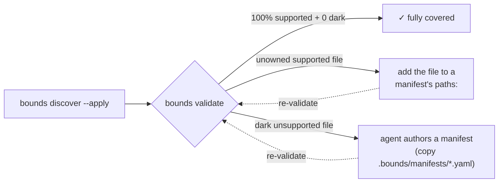

<div align="center">

<picture>
  <source media="(prefers-color-scheme: dark)" srcset="assets/bounds-wordmark.svg">
  
</picture>

### Verified architecture context for AI coding agents

**Give agents the map before they search. Catch drift in CI. Zero LLM on structural paths.**

<br/>


<br/>

[](https://github.com/Farzin312/bounds/actions/workflows/ci.yml)
[](LICENSE)
[](https://www.python.org)
[](docs/languages-and-platforms.md)
[](docs/how-it-works.md)
[](https://github.com/Farzin312/bounds/stargazers)

[Quick start](#quick-start) · [Why use it](docs/why-bounds.md) · [How it works](docs/how-it-works.md) · [SDD](docs/sdd.md) · [Token economics](docs/token-economics.md) · [CLI reference](docs/cli-reference.md) · [For AI agents](docs/ai-agents.md) · [Docs](docs/README.md)

</div>

---

**Bounds** turns each subsystem's intended boundary — its public surface, tables, and cross-module
dependencies — into a tiny contract that AI agents can query before reading source. Then it uses
**tree-sitter (zero LLM)** to verify that contract against your real code and **fail the build when
the two diverge**.

> *A code graph tells your agent what the code **is**; Bounds tells it what the code is **supposed
> to be** — and fails the build when those diverge. Use a graph to explore, use Bounds to enforce.*

> **Who it's for.** A team using coding agents on a mature codebase where "just read the repo" is
> expensive and unreliable. Bounds gives agents a small verified map first, then gives reviewers and
> CI a deterministic way to catch architectural drift.

## The problem

When an AI agent opens your repo, it does the expensive thing: it reads source files — sometimes
dozens — to reconstruct what each part does and how the parts connect. Every file burns tokens, every
wrong guess produces a bad edit, and the agent's mental model has no way to *check* itself when its
picture of the architecture has drifted from the code.

But an agent doesn't need every function in `auth.ts`. It needs *"auth exposes `login`, `verify`,
`register` and talks to the database via `user_repository`."* That fits in five lines of YAML — and a
machine can reason about it **deterministically**.

<div align="center">

</div>

## What Bounds does

Bounds maintains a hidden `.bounds/` directory of tiny YAML **subsystem manifests** and uses
tree-sitter to validate them against your real source, in both directions.

- **`bounds describe`** — hand an agent a subsystem's exact public surface as JSON, each interface flagged `verified: true/false`; schema subsystems include the current table catalog folded from migrations, plus — for Postgres/Supabase — the live policy/RLS surface and a derived **RLS posture** (which tables are protected vs exposed).
- **`bounds validate`** — catch drift the moment your code's exports stop matching the manifest. Seven checks, zero LLM.
- **`bounds validate --quick`** — git-diff incremental validation, safe for every commit.
- **`bounds preflight`** — run all the pre-PR checks at once: drift, boundary violations, broken contracts, dependency cycles, orphaned subsystems, and cross-subsystem impact.
- **`bounds impact <name>`** — transitive blast radius: who breaks if this subsystem's surface or a table changes.
- **`bounds discover` / `bounds calibrate`** — set up manifests for a repo that has none in one command, then keep them honest against what tree-sitter actually finds in your source.
- **`bounds agent --sync`** — wire Bounds into eight coding agents (Claude Code, Codex, Gemini, Cursor, …) with one command. It generates each tool's *native* invokable command/skill — an auto-triggering Claude/Codex **skill**, a Gemini/OpenCode **command**, a Copilot **prompt file**, a Windsurf **workflow** — plus the shared `AGENTS.md` contract, so the agent reaches for Bounds on its own. Bare `bounds agent` lists which agents are present (read-only).
- **`bounds guide`** — a state-aware setup checklist (init → discover → wire agents → CI) for humans and agents; `bounds guide --sdd` previews the optional Spec-Driven Development track; `bounds --help` groups every command by purpose.
- **Deterministic** — same input, same byte-stable output. No network, no flakiness.

## Why use it

- **Give agents a small verified contract instead of source** — one cheap CLI call returns a tree-sitter-confirmed public surface (a few hundred tokens for a small subsystem on this repo; cost scales with how many symbols/tables it *exposes*, not how big it is), not a dozen files an agent has to read and guess at.
- **Answer the database question an agent gets wrong by reading** — "what columns does `orders` have *now*, and is it row-level-security protected?" isn't in one file; it's a `CREATE` plus a dozen `ALTER`s across migrations. Bounds folds them into the current table + RLS-policy surface and a derived **RLS posture** (which tables are exposed *without* RLS). When a migration uses DDL it can't parse, `schema_coverage` says so — so an agent never reads a blind spot as "this doesn't exist."
- **Show blast radius before a risky change** — `bounds impact` returns the transitive consumer set and the interfaces each one relies on, so you know the reach before you write the edit.
- **Catch architecture drift in CI before it merges** — `bounds ci --install --github|--gitlab|--precommit|--all` (auto-detects your host with no flag) wires a `bounds preflight --ci` gate so boundary violations and stale contracts become a failing check with a fix suggestion, not a convention nobody follows. An *intentional* surface change is a deliberate re-baseline (`bounds calibrate --dump-baseline`), not a red build.
- **Ground Spec-Driven Development in the real architecture** — opt in with `sdd:` in `.bounds/root.yaml` and Bounds becomes the verified architecture layer across specify → clarify → plan → tasks → analyze → implement → verify. It does not replace your agent's SDD prompts; it gives them `overview`/`describe`/`impact` facts and `validate`/`preflight` gates so specs, manifests, and implementation stay aligned.

See [docs/why-bounds.md](docs/why-bounds.md) for the full rationale.

---

## Quick start

```bash
# Install (works today — PyPI/Homebrew pending publish)
pipx install "git+https://github.com/Farzin312/bounds.git"

cd your-project
bounds guide                 # state-aware setup checklist (what to run next)
bounds guide --sdd           # preview the optional SDD phase track
bounds discover --apply      # auto-generate root.yaml + manifests from your source
bounds agent --sync          # teach Claude/Codex/Gemini/Cursor/etc. to query Bounds first
bounds describe auth         # one subsystem's verified surface, as JSON
bounds impact users          # if users is a table/interface, see declared consumers before changing it
bounds validate --quick      # fast incremental drift check
bounds upgrade-check         # is a newer release available?
```

`bounds discover` groups source by directory, tree-sitter-extracts each subsystem's `exposes`, infers
`consumes` from the import graph, and never overwrites existing manifests. See
[docs/install.md](docs/install.md) for all install channels.

If `bounds --help` does not list `impact`, `discover`, and `agent`, your installed CLI is stale; run
`bounds upgrade` or see [docs/install.md](docs/install.md#verify).

> `.bounds/` is hidden and **only** touched by the `bounds` CLI. Its extraction cache is a binary
> SQLite file (`.bounds/cache.db`, **gitignored and regenerated** — never committed) so a tool that
> blindly dumps a directory gets binary bytes, not a parseable token blob. This is an
> *accidental-context-burn* defense, **not** access control — the manifests are plain YAML any agent
> can read.

---

## Scales with what you expose, not your code size

Reading source is **O(files)** — the bigger the subsystem, the more an agent reads. A Bounds contract
is **O(public surface)** — it grows only with what a subsystem *exposes* (its public symbols, tables,
and dependencies), not its internal size, so it climbs far more slowly: a subsystem with 50 internal
functions behind 5 exports stays a few hundred tokens.

<div align="center">

</div>

The token win *widens* with size.

### Verified on real open-source repos

Exact `tiktoken cl100k_base` counts (not an estimate) from a **16-repo, cross-language sweep**. The
harness shallow-clones each repo at a cited commit, runs `bounds init` + `bounds discover`, and
counts tokens (Bounds output vs the equivalent source). Full corpus, full-command coverage, and the
bugs it surfaced: **[benchmarks/results/oss-cross-language.md](benchmarks/results/oss-cross-language.md)**.

| Repo | Whole-repo orientation (`bounds list`) | One subsystem's surface (`bounds describe`) |
|------|----------------------------------------|-----------------------------------------|
| [click](https://github.com/pallets/click) (Python) | 243 vs 196,257 tok — **99.9% less** | `click` (505 exports): 6,955 vs 93,020 — **92.5% less** |
| [axios](https://github.com/axios/axios) (TypeScript) | 977 vs 526,284 tok — **99.8% less** | `lib`: 1,007 vs 47,092 — **97.9% less** |
| [nest](https://github.com/nestjs/nest) (TS, 199 subsystems) | 15,742 vs 1,305,335 tok — **98.8% less** | `packages-common`: 8,036 vs 116,149 — **93.1% less** |
| [zod](https://github.com/colinhacks/zod) (TypeScript) | 1,285 vs 1,772,284 tok — **99.9% less** | `core` (831 exports): 35,493 vs 117,947 — **69.9% less** |

Across all 13 supported-language repos, whole-repo `bounds list` is **98.7–100%** smaller than
reading every file, and a single `bounds describe` is **54–100%** smaller than its subsystem's
source. The `describe` spread is real and tracks how much a subsystem *exposes*: a typical
one is a **median of a few hundred tokens**, while a fat-API subsystem (zod's `core`, 831 exports)
is ~35k. *Honest caveat:* "vs all source" is a generous baseline — nobody reads a whole repo — so
read 99% as "orientation is near-free," and the **54–100% `describe`** range as the number that
matters for real work.

A same-model **capability head-to-head** on click (answer "what's the public API and what depends on
it?") cost ~7.2k tokens (`describe` + `impact`) and was tree-sitter-verified *with* Bounds, versus
~93k tokens of source the model must read and infer the public surface from *without* it — **~13×
cheaper** and more reliable. (Bounds is a navigation layer, not a comprehension layer — you still
read source to understand *behavior*.)

> **Honest scope.** Those numbers are extraction + retrieval economics, which generalize. The
> auto-`discover` contracts are a **starting draft to curate** — but a fresh `discover → validate`
> now converges *close to clean* on well-factored repos (click **3** issues, express **1**, requests
> **6** — all `ok: true`) and to a small set of genuine, mostly-advisory issues on large or
> type-heavy ones (flask 19, axios 59, zod 155 — down from 314 / 191 / 3,025 before the noise fixes).
> What remains is real signal (boundary edges, cross-module re-export kinds), not flood: the
> orphan-export, test-case, and Next.js framework-callback floods are eliminated (see
> [docs/known-issues.md](docs/known-issues.md) BOUNDS-012/015/016). Treat the drift gate as something
> you reach after a light curation pass, not a one-command guarantee on every repo. The
> [cross-language report](benchmarks/results/oss-cross-language.md) documents this in full.

**Contributors welcome:** `make benchmark` reports this repo's own coverage + token economics, and
`make oss-bench REPO=<path>` runs the full coverage + token + command-surface report on any cloned
repo (one reproducible command, no hand-assembled tables). Add your model/tokenizer's numbers via
[`benchmarks/TEMPLATE.md`](benchmarks/TEMPLATE.md) — see [benchmarks/README.md](benchmarks/README.md).
See [docs/token-economics.md](docs/token-economics.md) for the scaling argument and the context-rot
effect.

## Mapping coverage — 100% of what Bounds can parse, and an agent for the rest

Bounds reports how much of your **supported-language source** it verified — deterministically, no LLM.
`bounds validate` (`stats.coverage.mapping`), `bounds overview` (`health.validation.mapped_pct`), and
`bounds discover` all carry the same signal: `mapped_pct` (**supported-language source only, so 100% is
reachable**), the unowned files, and a separate, honest account of the **unsupported-language** source
Bounds has no adapter for — split into `declared` (a manifest claims it → covered) and `dark` (no
manifest → the real gap). A partial map is always *visible*, never silently half-dark; tests and docs
are tracked in their own buckets and never drag the number down.

There are exactly two closeable gaps, and an agent can close either — with the CLI as the deterministic
verifier:



- **Unowned but supported** (a Python/TS/JS/SQL/Prisma/shell file in no subsystem) → add it to a manifest's
  `paths:`. Deterministic, no AI needed; `mapped_pct` rises to 100%.
- **Unsupported language** (Go/Rust/Java — no adapter yet) → the `E_COVERAGE_GAP` fix hands the
  agent the `by_language` list and a concrete template manifest to copy; it authors `paths` + a
  hand-written `exposes` (+ `consumes`), then `bounds validate` confirms it clean. That **moves the
  file from `dark` to `declared`** — the gap closes even though Bounds can't parse it. Those
  hand-authored exposes are **durable**: `calibrate` routes a not-found one to `needs_review` (never
  strips it) and `validate` never flags it as drift, so the work survives.

So **"100%" means 100% of supported-language source mapped, with zero unclaimed (`dark`) files** —
Bounds names exactly what it can't yet parse and hands an agent a template, instead of guessing or
quietly inflating the number. As language adapters ship, files move from `unsupported` to verified
automatically and the number rises on its own.

The full human-and-AI workflow is in **[docs/coverage.md](docs/coverage.md)**. On this repo `bounds
validate` reports **100% of supported-language source mapped** (38/38 non-test files) — Bounds
dogfoods its own gate.

## Languages & platforms

Bounds is **sharpest on the modern full-stack — TypeScript/JavaScript + Postgres/Supabase** — where
the verified table + **RLS/policy** surface is a differentiator few context tools offer, and it knows
Next.js App-/Pages-Router conventions so a real app's route/page entry files don't read as drift.
**Python is equally first-class** (it converges cleanest of all on a fresh discover). 

**Python, TypeScript/JavaScript, SQL migrations, and Prisma schemas** are verified today — including
database tables, whether declared as raw DDL, ORM models (SQLAlchemy/Django/Drizzle/TypeORM), or
Prisma `model` blocks. For **Postgres/Supabase SQL** Bounds also folds functions, views, indexes,
triggers, and **row-level-security policies** (descending into `BEGIN;…COMMIT;` transactions), and
derives an RLS posture. tree-sitter-sql can't parse every Postgres construct (a `DO $$…$$` block,
some pg_dump output); when a DDL statement is genuinely unparsable the catalog **self-reports it**
(`E_SCHEMA_UNPARSED`) rather than silently dropping it, and a no-DDL file (seed/grant/cron) is never
flagged.

**Frameworks (TypeScript/JavaScript).** The import resolver handles the conventions real frameworks
use, so the dependency graph is accurate on them and not just on flat repos: relative imports of
**dot-named files** (`auth.service.ts`, `login.dto.ts` — the NestJS/Angular convention) and
**tsconfig path aliases** (`@/…`, `@app/*`) plus `baseUrl`-relative bare imports, following a chain
of `extends`. *Honest limits:* one `*` wildcard per `paths` entry, and an alias that resolves into a
`node_modules` package (e.g. a monorepo `workspace:` dependency) is treated as external. Verified
end-to-end on [click](https://github.com/pallets/click) (Python) and
[axios](https://github.com/axios/axios) (TypeScript); NestJS/Angular import shapes are covered by the
resolver test matrix.

Three honest tiers: **fully supported** (Python, TS/JS, SQL, Prisma, shell — extracted *and* verified),
**partially supported** (a supported parser with a documented, self-reported gap — e.g. an
unparseable Postgres DDL statement, flagged `E_SCHEMA_UNPARSED`, with the rest of the file still
folded), and **unsupported** (Go, Rust, Java — no adapter yet, but **hand-mappable and durable**: a
hand-authored manifest survives `calibrate`/`validate`, never silently stripped or flagged). Every
gap surfaces loudly with a next step — never a silent omission. Go and Rust adapters target v0.2.0,
Java v0.3.0; adding one is a single
[adapter class](docs/languages-and-platforms.md#adding-a-language-adapter). Runs on **Linux, macOS,
and Windows** (Python 3.10–3.14). Full
[support matrix + roadmap](docs/languages-and-platforms.md).

---

## Documentation

**Start here**
- [why-bounds.md](docs/why-bounds.md) — the rationale: token-lean agent context, blast radius, drift control.
- [team-workflow.md](docs/team-workflow.md) — how a team adopts Bounds day to day.
- [use-cases.md](docs/use-cases.md) — concrete workflows: pre-PR safety, onboarding, CI enforcement.
- [sdd.md](docs/sdd.md) — optional Spec-Driven Development integration and freshness contract.

**Reference**
- [cli-reference.md](docs/cli-reference.md) — every command and flag.
- [coverage.md](docs/coverage.md) — the mapping-coverage signal, aiming for 100%, and how a human or an agent closes a gap.
- [ai-agents.md](docs/ai-agents.md) — `agent --sync`, the canonical contract, advisory compliance.
- [sdd.md](docs/sdd.md) — `root.yaml` opt-in, `guide --sdd`, and per-agent SDD wiring.
- [languages-and-platforms.md](docs/languages-and-platforms.md) — language support matrix and cross-platform notes.
- [install.md](docs/install.md) — all install channels and their current status.

**Deep dives**
- [how-it-works.md](docs/how-it-works.md) — three-tier model, validation engine, quick mode, the binary cache.
- [token-economics.md](docs/token-economics.md) — measured token costs, scaling tables, context rot.
- [comparison.md](docs/comparison.md) — Bounds vs. code graphs, and what Bounds deliberately does *not* do.

Full docs index: [docs/README.md](docs/README.md). Engineering contract: [ARCHITECTURE.md](ARCHITECTURE.md).

---

## Contributing & license

Bounds is **MIT-licensed** (c) Farzin Shifat and built to be extended — adding a language adapter is
one class plus a registry entry. See [CONTRIBUTING.md](CONTRIBUTING.md) for setup, coding standards,
and PR workflow; [ARCHITECTURE.md](ARCHITECTURE.md) for the engineering contract;
[SECURITY.md](SECURITY.md) for security principles and disclosure; and
[CHANGELOG.md](CHANGELOG.md) for release notes.
