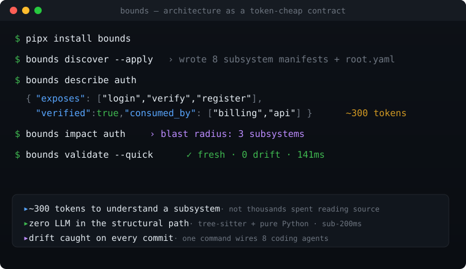
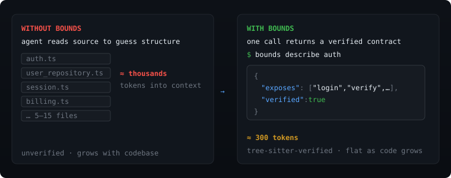

<div align="center">

# Bounds

### Verified architecture context for AI coding agents

**Give agents the map before they search. Catch drift in CI. Zero LLM on structural paths.**



**Bounds** turns each subsystem's intended boundary — its public surface, tables, and cross-module
dependencies — into a tiny contract that AI agents can query before reading source. Then it uses
**tree-sitter (zero LLM)** to verify that contract against your real code and **fail the build when
the two diverge**.

> *A code graph tells your agent what the code **is**; Bounds tells it what the code is **supposed
> to be** — and fails the build when those diverge. Use a graph to explore, use Bounds to enforce.*

[](https://github.com/Farzin312/bounds/actions/workflows/ci.yml)
[](LICENSE)
[](https://www.python.org)
[](docs/languages-and-platforms.md)
[](docs/how-it-works.md)
[](https://github.com/Farzin312/bounds/stargazers)

[Quick start](#quick-start) · [Why use it](docs/why-bounds.md) · [How it works](docs/how-it-works.md) · [Token economics](docs/token-economics.md) · [CLI reference](docs/cli-reference.md) · [For AI agents](docs/ai-agents.md) · [Docs](docs/README.md)

</div>

---

> **Who it's for.** A team using coding agents on a mature codebase where "just read the repo" is
> expensive and unreliable. Bounds gives agents a small verified map first, then gives reviewers and
> CI a deterministic way to catch architectural drift.

## The problem

When an AI agent opens your repo, it does the expensive thing: it reads source files — sometimes
dozens — to reconstruct what each part does and how the parts connect. Every file burns tokens, every
wrong guess produces a bad edit, and the agent's mental model has no way to *check* itself when its
picture of the architecture has drifted from the code.

But an agent doesn't need every function in `auth.ts`. It needs *"auth exposes `login`, `verify`,
`register` and talks to the database via `user_repository`."* That fits in five lines of YAML — and a
machine can reason about it **deterministically**.

<div align="center">

</div>

## What Bounds does

Bounds maintains a hidden `.bounds/` directory of tiny YAML **subsystem manifests** and uses
tree-sitter to validate them against your real source, in both directions.

- **`bounds describe`** — hand an agent a subsystem's exact public surface as JSON, each interface flagged `verified: true/false`; schema subsystems include the current table catalog folded from migrations, plus — for Postgres/Supabase — the live policy/RLS surface and a derived **RLS posture** (which tables are protected vs exposed).
- **`bounds validate`** — catch drift the moment your code's exports stop matching the manifest. Seven checks, zero LLM.
- **`bounds validate --quick`** — git-diff incremental validation, safe for every commit.
- **`bounds preflight`** — run all the pre-PR checks at once: drift, boundary violations, broken contracts, dependency cycles, orphaned subsystems, and cross-subsystem impact.
- **`bounds impact <name>`** — transitive blast radius: who breaks if this subsystem's surface or a table changes.
- **`bounds discover` / `bounds calibrate`** — set up manifests for a repo that has none in one command, then keep them honest against what tree-sitter actually finds in your source.
- **`bounds agent --sync`** — wire Bounds into eight coding agents (Claude Code, Codex, Cursor, …) with one command.
- **Deterministic** — same input, same byte-stable output. No network, no flakiness.

## Why use it

- **Give agents a small verified contract instead of source** — one cheap CLI call returns a tree-sitter-confirmed public surface (a few hundred tokens for a small subsystem on this repo; cost scales with how many symbols/tables it *exposes*, not how big it is), not a dozen files an agent has to read and guess at.
- **Answer the database question an agent gets wrong by reading** — "what columns does `orders` have *now*, and is it row-level-security protected?" isn't in one file; it's a `CREATE` plus a dozen `ALTER`s across migrations. Bounds folds them into the current table + RLS-policy surface and a derived **RLS posture** (which tables are exposed *without* RLS). When a migration uses DDL it can't parse, `schema_coverage` says so — so an agent never reads a blind spot as "this doesn't exist."
- **Show blast radius before a risky change** — `bounds impact` returns the transitive consumer set and the interfaces each one relies on, so you know the reach before you write the edit.
- **Catch architecture drift in CI before it merges** — boundary violations and stale contracts become a failing check with a fix suggestion, not a convention nobody follows.

See [docs/why-bounds.md](docs/why-bounds.md) for the full rationale.

---

## Quick start

```bash
# Install (works today — PyPI/Homebrew pending publish)
pipx install "git+https://github.com/Farzin312/bounds.git"

cd your-project
bounds discover --apply      # auto-generate root.yaml + manifests from your source
bounds agent --sync          # teach Claude/Codex/Cursor/etc. to query Bounds first
bounds describe auth         # one subsystem's verified surface, as JSON
bounds impact users          # if users is a table/interface, see declared consumers before changing it
bounds validate --quick      # fast incremental drift check
bounds upgrade-check         # is a newer release available?
```

`bounds discover` groups source by directory, tree-sitter-extracts each subsystem's `exposes`, infers
`consumes` from the import graph, and never overwrites existing manifests. See
[docs/install.md](docs/install.md) for all install channels.

If `bounds --help` does not list `impact`, `discover`, and `agent`, your installed CLI is stale; run
`bounds upgrade` or see [docs/install.md](docs/install.md#verify).

> `.bounds/` is hidden and **only** touched by the `bounds` CLI. Its extraction cache is a binary
> SQLite file (`.bounds/cache.db`, **gitignored and regenerated** — never committed) so a tool that
> blindly dumps a directory gets binary bytes, not a parseable token blob. This is an
> *accidental-context-burn* defense, **not** access control — the manifests are plain YAML any agent
> can read.

---

## Scales with your public API, not your code size

Reading source is **O(files)** — the bigger the subsystem, the more an agent reads. A Bounds contract
is **O(public API)** — it grows only with what a subsystem *exposes*, not its internal size, so it
climbs far more slowly: from a few hundred tokens for a small subsystem (a subsystem with 50 internal
functions and 5 exports stays small).

<div align="center">

</div>

The token win *widens* with size. See [docs/token-economics.md](docs/token-economics.md) for the
measured numbers (one repo, one data point), the scaling argument, and the context-rot effect.

## Languages & platforms

**Python, TypeScript/JavaScript, SQL migrations, and Prisma schemas** are verified today — including
database tables, whether declared as raw DDL, ORM models (SQLAlchemy/Django/Drizzle/TypeORM), or
Prisma `model` blocks. For **Postgres/Supabase SQL** Bounds also folds functions, views, indexes,
triggers, and **row-level-security policies** (descending into `BEGIN;…COMMIT;` transactions), and
derives an RLS posture. tree-sitter-sql can't parse every Postgres construct (a `DO $$…$$` block,
some pg_dump output); when a DDL statement is genuinely unparsable the catalog **self-reports it**
(`E_SCHEMA_UNPARSED`) rather than silently dropping it, and a no-DDL file (seed/grant/cron) is never
flagged. Runs on **Linux, macOS, and Windows** (Python 3.10–3.14). Go, Rust, and Java adapters are on
the roadmap. See [docs/languages-and-platforms.md](docs/languages-and-platforms.md).

---

## Documentation

**Start here**
- [why-bounds.md](docs/why-bounds.md) — the rationale: token-lean agent context, blast radius, drift control.
- [team-workflow.md](docs/team-workflow.md) — how a team adopts Bounds day to day.
- [use-cases.md](docs/use-cases.md) — concrete workflows: pre-PR safety, onboarding, CI enforcement.

**Reference**
- [cli-reference.md](docs/cli-reference.md) — every command and flag.
- [ai-agents.md](docs/ai-agents.md) — `agent --sync`, the canonical contract, advisory compliance.
- [languages-and-platforms.md](docs/languages-and-platforms.md) — language support matrix and cross-platform notes.
- [install.md](docs/install.md) — all install channels and their current status.

**Deep dives**
- [how-it-works.md](docs/how-it-works.md) — three-tier model, validation engine, quick mode, the binary cache.
- [token-economics.md](docs/token-economics.md) — measured token costs, scaling tables, context rot.
- [comparison.md](docs/comparison.md) — Bounds vs. code graphs, and what Bounds deliberately does *not* do.

Full docs index: [docs/README.md](docs/README.md). Engineering contract: [ARCHITECTURE.md](ARCHITECTURE.md).

---

## Contributing & license

Bounds is **MIT-licensed** (c) Farzin Shifat and built to be extended — adding a language adapter is
one class plus a registry entry. See [CONTRIBUTING.md](CONTRIBUTING.md) for setup, coding standards,
and PR workflow; [ARCHITECTURE.md](ARCHITECTURE.md) for the engineering contract;
[SECURITY.md](SECURITY.md) for security principles and disclosure; and
[CHANGELOG.md](CHANGELOG.md) for release notes.
