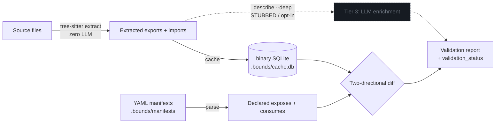

# How Bounds works

*The mechanism: a three-tier data model, two-directional validation, a context-armored cache, and an incremental quick path — all zero-LLM on the structural path.*

[← Docs index](./README.md) · [Bounds README](../README.md)

---

Bounds maintains a hidden `.bounds/` directory of **subsystem boundary manifests** — tiny YAML files that declare each subsystem's role, its public interfaces (`exposes`), and its cross-boundary dependencies (`consumes`). It then uses **tree-sitter** (never an LLM) to extract the *actual* exported symbols and imports from your source, and validates the manifests against that reality in both directions.

## Three-tier data model

Only the top tier ever costs a token. The core validation loop runs Tiers 1 + 2 only — it never touches an LLM.

| Tier | Source | Cost | What it contains |
|------|--------|------|------------------|
| **1 — Deterministic** | tree-sitter extraction | **Zero LLM** | Exported symbol names, file paths, import statements |
| **2 — Declared** | Human-written YAML | **Zero LLM** | Descriptions, boundary definitions, contract metadata |
| **3 — Semantic** | LLM, on demand (`--deep`) | Tokens per use | Type signatures, intent summaries |

**Tier 3 is opt-in and STUBBED in the MVP.** `bounds describe <name> --deep` is the only entry point to the semantic tier, and in this build it returns a placeholder note rather than calling an LLM (`{"semantic": {"note": "LLM enrichment (Tier 3) not enabled in this build"}}`). No structural path ever touches an LLM — that is a non-negotiable design rule, not a current limitation that might quietly change.

Today, Tier 1 extraction is fully implemented for **Python, TypeScript/JavaScript, SQL migrations, and Prisma schemas**. Go and Rust adapters are on the v0.2 roadmap, Java on v0.3; until then those languages fall back to YAML-only declared files (no tree-sitter verification) or are skipped if only auto-discovered.

## How `describe` merges Tiers 1 + 2

`bounds describe` is where the deterministic and declared tiers meet. It returns the subsystem's declared surface, but **annotates each declared `exposes` entry with tree-sitter facts** so an agent can trust the manifest without reading source:

- **`verified: true/false`** — `true` means tree-sitter confirmed the symbol actually exists in the subsystem's source. A `false` flag is the signal that the manifest claims something the code doesn't back up.
- **`file`** — the repo-relative path where the symbol was found.
- **`entry_point: true`** — set when the symbol sits inside a root-level `entry_points` glob.

That merge is the whole trust story: the manifest is human-declared intent, and the per-interface flags are the machine's confirmation that the intent still matches reality.

## The validation engine

The engine diffs *declared* exports against *extracted* exports and reports drift in two directions:

```
Source files ──tree-sitter──> Extracted exports  ──┐
                                                   ├──> Two-directional diff ──> Validation report
YAML manifests ──parse──────> Declared exports  ───┘
                                    +
                              Consumed interfaces
```

The same flow, including the opt-in semantic tier (shown dotted because it is stubbed and not part of validation):



> The structural path (solid arrows) never touches an LLM. Tier 3 (dotted) — `describe --deep` — is opt-in enrichment and stubbed in the MVP; it is not part of validation. Zero LLM in the structural path: deterministic, no network, no API keys.

The two-directional diff distinguishes three failure modes:

- **Stale manifest** — the manifest claims an export the source no longer provides (`E_STRUCTURAL_DRIFT`).
- **Incomplete manifest** — the source exports something the manifest doesn't declare (drift in the other direction).
- **Cross-subsystem drift** — a provider's interface surface changed and a consumer still declares an interface the provider no longer exports (`E_STALE_INTERFACE`, `E_CONTRACT_MISSING_EXPORT`).

Every `describe`/`validate` payload carries a machine-readable `validation_status` (`fresh` / `stale` / `unresolved`) an agent can branch on. The full set of seven checks and their error codes is specified in [../ARCHITECTURE.md](../ARCHITECTURE.md) §7–8.

## The cache is binary by design — context armor, not access control

Extraction results are cached in `.bounds/cache.db`, a **binary SQLite file** (SQLite ships with Python — no new dependency). This is a deliberate *accidental-context-burn* defense: a tool that blindly dumps every file in a directory gets binary bytes rather than a giant parseable token blob slurped into context.

Be honest about what this is and isn't:

- It **does not** stop a determined agent and it is **not** access control. The manifests in `.bounds/manifests/*.yaml` are plain human-readable YAML, and any agent can read them directly. Only the *derived* extraction data is binary — the human-authored boundary declarations stay readable on purpose.
- What it buys you: naive file-dumping tools can't trivially turn the cache into tokens.

The cache is subsystem-indexed (so a caller can do partial per-subsystem reads instead of materializing the whole thing), gitignored, and managed by `bounds cache` — `--inspect` prints a token-lean counts-only summary (never symbol dumps), `--prune` drops dead rows, and `--migrate` converts a legacy `state.json` cache. `updated_at` is always written empty (no wall-clock), so the cache is byte-stable across runs. Schema and determinism rules: [../ARCHITECTURE.md](../ARCHITECTURE.md) §10.

## Quick mode (incremental)

`bounds validate --quick` keeps validation work sub-200ms by never walking the full tree:

1. `git diff` against the base ref — find changed files.
2. Re-extract with tree-sitter **only** for changed files; reuse the content-hash cache for the rest.
3. Compare extracted exports against declared per subsystem.
4. **Reference propagation** — for each changed subsystem, check every consumer's declared interfaces against current exports by manifest graph. This is interface-name comparison, zero tree-sitter.

A content-only edit (comment or function body) changes a file's `content_hash` but not its `structure_hash`, so consumers are not invalidated and propagation stops early. On a warm cache with nothing changed, `--quick` re-extracts zero files — pure reference propagation and exit. In quick mode every issue is downgraded to a non-blocking warning (except `--fail-on-unowned`, which stays a hard gate in any mode).

## Performance

Bounds is fast enough to run on every commit: the validation logic itself completes in roughly **130–200ms**, with another **~150ms** of Python interpreter startup on top. On a warm cache, `--quick` re-extracts zero files when nothing has changed — pure reference propagation and exit.

Latency is machine-relative, so Bounds pins no single number and no hardware spec here. The reproducible, regenerated-on-demand measurements — and the methodology that deliberately keeps latency out of the headline metrics — live in [../benchmarks/results/claude-baseline.md](../benchmarks/results/claude-baseline.md), the single source of truth for performance figures.

---

**See also:** [./token-economics.md](./token-economics.md) for the cost argument and retrieval-scaling analysis · [../ARCHITECTURE.md](../ARCHITECTURE.md) for the full engineering contract (modules, data model, checks, error codes, JSON shapes).
