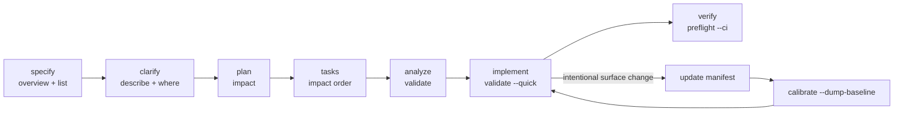

# Bounds and Spec-Driven Development

Bounds is an optional architecture layer for Spec-Driven Development (SDD). It does not replace
Spec Kit, Claude Code, Codex, Gemini CLI, OpenCode, Copilot, Cursor, Windsurf, Aider, or a team's
custom prompts. It gives those workflows a deterministic source of architecture facts and a gate
that proves the implementation still matches the intended subsystem contract.

[← Docs index](./README.md) · [Bounds README](../README.md)

---

## The model

SDD conventions differ by agent and by project. GitHub Spec Kit ships a common workflow and command
family, but even there the integration surface varies: most agents expose `/speckit.*` commands,
while Codex skills mode uses skill-style commands. Claude Code distinguishes project skills and
slash commands; Codex reads layered `AGENTS.md`; Gemini CLI discovers project TOML commands under
`.gemini/commands/`; OpenCode discovers Markdown commands under `.opencode/commands/`.

That means Bounds should not impose one universal SDD runner. The right design is composable:

- Bounds commands provide verified architecture facts: `overview`, `list`, `describe`, `where`,
  `impact`.
- Bounds gates provide deterministic consistency checks: `validate --quick`, `preflight --ci`,
  `calibrate --check`.
- The agent still owns the prose/spec workflow. Bounds only grounds and enforces it.

Primary references:

- GitHub Spec Kit: <https://github.github.com/spec-kit/>
- Spec Kit repository and command matrix: <https://github.com/github/spec-kit>
- Claude Code skills: <https://code.claude.com/docs/en/skills>
- Codex `AGENTS.md`: <https://developers.openai.com/codex/guides/agents-md>
- Gemini CLI custom commands: <https://google-gemini.github.io/gemini-cli/docs/cli/custom-commands.html>
- OpenCode commands: <https://dev.opencode.ai/docs/commands>

---

## Opt in

Add an optional `sdd:` block to `.bounds/root.yaml`:

```yaml
sdd:
  enabled: true
  agent: codex
  phases: [specify, clarify, plan, tasks, analyze, implement, verify]
```

Fields:

- `enabled`: `true` turns on SDD-aware guide and agent-sync wiring.
- `agent`: one of `claude`, `codex`, `gemini`, `opencode`, `copilot`, `cursor`, `windsurf`,
  `aider`, or `generic`.
- `phases`: optional subset of `specify`, `clarify`, `plan`, `tasks`, `analyze`, `implement`,
  `verify`. Omit it to use all phases.

Absent `sdd:` means today's behavior. You can preview the track without committing config:

```bash
bounds guide --sdd
```

Enable and configure SDD from the CLI — no manual YAML editing needed:

```bash
bounds sdd --enable                              # write sdd.enabled: true, all phases
bounds sdd --enable --phases specify,implement,verify  # enable with a phase subset
bounds sdd --disable                             # write sdd.enabled: false
bounds sdd --add-phase clarify                   # add one phase to the configured list
bounds sdd --remove-phase clarify                # remove one phase
```

Inspect the configured command map:

```bash
bounds sdd                       # configured phases + deterministic commands
bounds sdd --phase implement     # one phase; reports whether it is configured
bounds sdd --doctor              # config + full/quick/preflight readiness checks
```

`bounds sdd` does **not** infer the current prose phase or claim a phase is complete. That state
belongs to the team's spec workflow, not to deterministic architecture inspection.

`bounds agent --sync` includes the SDD phase contract in generated agent files only when `sdd.enabled`
is true. The regular Bounds contract still appears in `AGENTS.md`, because agents should know Bounds
exists even outside SDD.

---

## Phase Map



### specify

Run `bounds overview` and `bounds list` before writing the spec. The goal is to anchor the spec in
the codebase that exists: subsystem names, roles, coverage gaps, boundaries, cycles, and trust notes.
This prevents specs from being written against an imagined architecture.

### clarify

Run `bounds describe <name>` and `bounds where <symbol>` when the spec needs to answer "what is the
current verified contract of X?" The answer is deterministic and token-lean: exported symbols,
tables, RLS posture, declared consumers, and verification status.

### plan

Run `bounds impact <name>` for any subsystem, table, or interface the plan intends to change. The
manifest is the contract the plan must respect. The impact output gives the blast radius and the
direct/transitive consumers that should appear in the plan.

### tasks

Scope tasks by subsystem and manifest. Use `impact` to order tasks when a provider change affects
consumers: provider contract first, then dependent subsystems, then verification.

### analyze

Before implementation, run `bounds validate` and compare the plan/tasks against
the declared architecture. A plan that crosses an undeclared boundary should either change the
architecture intentionally, with a manifest update, or avoid the dependency.

### implement

After each meaningful edit, run:

```bash
bounds validate --quick
```

If the spec intentionally changes a public surface, the manifest update is part of the implementation.
Do not treat intentional drift as something to suppress. Update the manifest, then re-baseline.

### verify

Before review or merge, run:

```bash
bounds preflight --ci
bounds calibrate --check
```

`preflight --ci` is the structural gate. `calibrate --check` catches new manifest-vs-source drift
above the committed `.bounds/drift-baseline.json`.

---

## Freshness Contract

The central SDD rule is simple: the spec, manifests, and implementation must move together.

- If a spec changes architecture, update the manifest in the same spec/plan change.
- If implementation changes architecture accidentally, `validate --quick` should flag it.
- If architecture changes intentionally, run `bounds calibrate --dump-baseline` after the manifest
  reflects the intended new contract, then commit `.bounds/drift-baseline.json`.
- CI runs `bounds preflight --ci` and `bounds calibrate --check` so new accidental drift is a failing
  signal, while accepted baseline drift is not re-litigated on every PR.

Edge cases:

- **Spec changes a boundary, manifest not updated:** `validate` or `calibrate --check` reports drift.
  The SDD next step is not "ignore the warning"; it is "update the manifest or revise the spec."
- **A phase is skipped:** Bounds still works because each command is independent. Skipping `clarify`
  means the agent has less verified context, not that Bounds state becomes inconsistent.
- **Intentional rewrite:** update manifests first, then re-baseline. A baseline without a matching
  manifest is just hiding drift.
- **Accidental drift:** do not re-baseline. Fix source or manifest so the declared contract and code
  match.
- **Multi-agent handoff:** commit the manifest and drift baseline alongside the spec artifacts. The
  next agent can run `bounds guide`, `bounds describe`, and `bounds calibrate --check` to recover the
  same architecture state.
- **Unsupported-language subsystem:** hand-authored exposes are durable. For Go, Rust, Java, and
  other unsupported languages, a curated manifest remains the contract; calibrate routes unverifiable
  exposes to review instead of deleting them, and validate does not flag them as source drift.
- **Generated files:** generated-code markers are cached per file, so quick validation can skip
  generated exports without rereading unchanged source. Calibrate and validate therefore agree on the
  quick path.

---

## Agent Wiring

When SDD is enabled, `bounds agent --sync` appends the same phase contract to each generated
agent artifact in that agent's native form:

- Claude Code: `.claude/skills/bounds/SKILL.md` and `.claude/commands/bounds.md`.
- Codex: `AGENTS.md` plus `.agents/skills/bounds/SKILL.md`.
- Gemini CLI: `.gemini/commands/bounds.toml`.
- OpenCode: `.opencode/commands/bounds.md`.
- Copilot: `.github/prompts/bounds.prompt.md`.
- Cursor: `.cursor/rules/bounds.mdc` and `.cursor/commands/bounds.md`.
- Windsurf: `.windsurf/rules/bounds.md` and `.windsurf/workflows/bounds.md`.
- Aider: `.aider.conf.yml` pointer only, because Bounds should not invent a command mechanism Aider
  does not load.

The generated files stay in each tool's canonical discovery path. That is intentional. Moving
`.pre-commit-config.yaml`, `.aider.conf.yml`, `AGENTS.md`, `GEMINI.md`, or `.github/...` files into a
tidier subdirectory would reduce root clutter but break automatic discovery for the tools that own
those paths. Bounds keeps them marker-managed, idempotent, and non-destructive instead.

---

## What Bounds Does Not Do

- It does not call a model on structural paths.
- It does not generate requirements text.
- It does not require GitHub Spec Kit or any one agent.
- It does not make every phase mandatory.
- It does not make generated agent guidance a hard gate. CI is the hard gate.

The mental model: SDD decides what should change; Bounds verifies what the architecture currently is
and whether the implementation still matches the declared contract.
